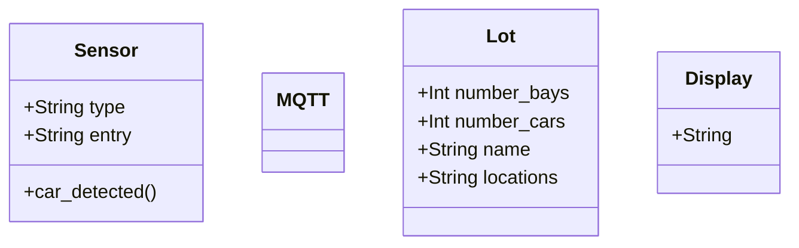

```mermaid

classDiagram

class Sensor{
    +String type
    +String entry
    +car_detected()
}

class MQTT{
    

}

class Lot{
    +Int number_bays
    +Int number_cars
    +String name
    +String locations

}

class Display{
    +String 
}
```